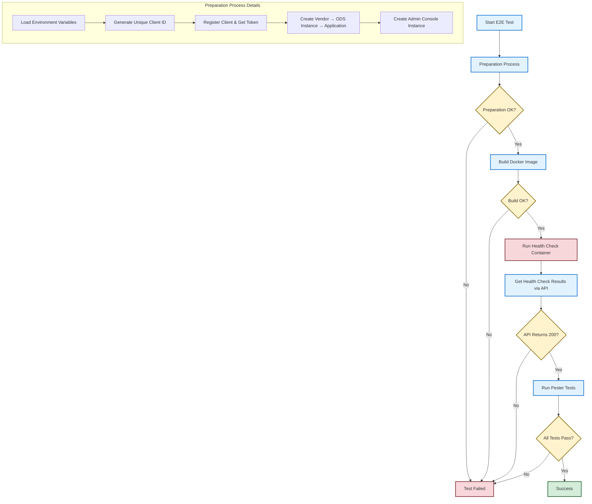

# Ed-Fi Admin Console Health Check Worker Process - E2E Testing Guide

## Overview

This document explains the End-to-End (E2E) testing implementation for the Ed-Fi Admin Console Health Check Worker Process. The E2E tests validate the complete workflow from creating instances in the Admin API to executing health checks and validating the results through proper test assertions.

## How the E2E Tests Work

### Test Workflow

The E2E test (`e2eTest.ps1`) follows this complete workflow:

1. **Environment Setup**: Load environment variables from Docker configuration
2. **Authentication**: Register a client and obtain access token from Admin API
3. **Resource Creation**: Create necessary resources in Admin API:
   - Vendor
   - ODS Instance
   - Application
   - Admin Console Instance
4. **Health Check Execution**: Build and run the Health Check Service Docker container
5. **Validation**: Retrieve health check results and validate using Pester test framework

### E2E Test Process Flow Diagram

### Process Flow Explanation

The streamlined diagram shows three main phases:

1. **Preparation Process**: Docker build, Authentication, resource creation, and environment setup
2. **Health Check Execution**:  Container run. Authentication is failing
3. **Validation Phase**: API validation and Pester test assertions

## How Assertions Are Done

### Assertion Strategy

The test uses **strict assertions** with the Pester testing framework:

1. **Status Code Validation**: Ensures API calls return expected HTTP status codes (200, 201)
2. **Response Type Validation**: Verifies response bodies are of expected types (enumerable collections)
3. **Business Logic Validation**: Validates that health check items exist and are healthy
4. **Failure Conditions**: The test fails if:
   - Any API call returns an unexpected status code
   - Health check response is null or empty
   - Any health check item has `healthy: false`
   - Required properties are missing from health check items

### Current Coverage

**Happy Path Workflow**:
   - Client registration and authentication
   - Resource creation (vendor, ODS instance, application, admin console instance)
   - Health check execution
   - Successful health check validation

### Required Services

1. **Ed-Fi Admin API**: Running instance with proper configuration
2. **PostgreSQL Database**: With EdFi ODS schema and AdminAPI required schemas
3. **Authentication Service**: This service needs to be defined. Further details are provided in the [Current State and Next Steps](#current-state-and-next-steps) section.

### Configuration Files

- `docker/.env`: Environment variables
- `docker/docker-compose.yml`: Services creation
- `payloads/*.json`: Test data templates

## Current State and Next Steps

### Current State

The environment is set up using Docker to run both the ODS-API and Admin API along with their databases. The Admin API was updated to use the latest endpoints, and corresponding payloads (e.g., for `adminconsole/odsInstance`) were adjusted to match the new schema.

This setup enables running the Health Check worker. However, the E2E test currently fails because the Health Check service attempts to authenticate using a Keycloak-generated token. Since the Admin API now uses self-contained authorization (Keycloak has been removed), this causes a token mismatch and results in authentication failure.

### Next Steps

- **Update Health Check Worker** to support Admin API’s new self-contained authorization  
- **Remove dependency on Keycloak** for Health Check authentication  
- **Create a new ticket** to track the work required for the auth update
